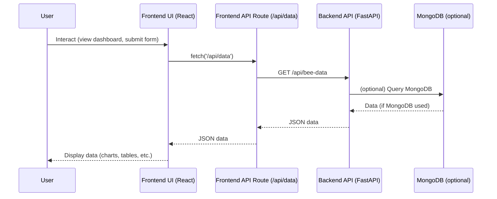

## Features

### Backend Features
- **FastAPI** REST API with automatic documentation
- **MongoDB** integration for data storage
- **Proxy endpoints** with realistic sample data generation
- **Real-time data** processing and analytics
- **CORS** support for frontend integration

### Frontend Features
- **Next.js 14** with App Router
- **Responsive dashboard** with modern UI
- **Data visualization** with charts and graphs
- **Real-time data** fetching and display
- **Data tables** with sorting and filtering

### Sample Data Generation
- **720 data points** (30 days × 24 hours)
- **Realistic bee behavior** patterns
- **Temperature cycles** following daily patterns
- **Humidity variations** inversely related to temperature
- **Bee activity** based on time and environmental conditions

## Dataflow Overview

### How Data Moves Through the Application

1. **User Interaction (Frontend UI)**
   - The user interacts with the frontend (Next.js/React), such as viewing dashboards or submitting forms.

2. **Frontend API Request**
   - The frontend makes a request to its own API route (e.g., `/api/data`).
   - Example: `fetch('/api/data')` in React components.

3. **Frontend API Route (Proxy Layer)**
   - The Next.js API route receives the request and acts as a proxy.
   - It forwards the request to the backend FastAPI server (e.g., `http://localhost:8000/api/bee-data`).

4. **Backend Processing**
   - The FastAPI backend receives the request.
   - If MongoDB is configured, it fetches real data from the database.
   - If not, it generates and returns sample/proxy data.

5. **Backend Response**
   - The backend sends the data (JSON) back to the frontend API route.

6. **Frontend API Route Response**
   - The frontend API route receives the backend's response and forwards it to the original frontend component.

7. **UI Update**
   - The React component receives the data and updates the UI (tables, charts, dashboards, etc.).


### Dataflow Diagram



**Summary:** The frontend never talks directly to the backend; it always goes through its own API routes, which act as a bridge/proxy. Data flows: User → Frontend UI → Frontend API Route → Backend API → (MongoDB) → Backend API → Frontend API Route → Frontend UI → User.

## 🛠️ Technology Stack

### Backend
- **Python 3.11**
- **FastAPI 0.104.1**
- **Uvicorn 0.24.0**
- **Pydantic 2.5.0**
- **Motor 3.3.1** (Async MongoDB driver)
- **Python-dotenv 1.1.1**

### Frontend
- **Next.js 14**
- **React 18**
- **TypeScript**
- **Tailwind CSS**
- **Chart.js** for data visualization

## 📋 Prerequisites

- **Python 3.11** or higher
- **Node.js 18** or higher
- **MongoDB** (optional - uses proxy data for development)
- **Git**

## 🔧 Installation & Setup

### 1. Clone the Repository
```bash
git clone <repository-url>
cd bio-d-scan
```

### 2. Backend Setup

```bash
cd backend

# Create virtual environment
python -m venv venv

# Activate virtual environment
.\venv\Scripts\Activate.ps1

# Install dependencies
pip install -r requirements.txt
```

### 3. Frontend Setup

```bash
cd bio-d-scan

# Install dependencies
npm install
```

## 🚀 Running the Application

### Backend Development Server

```bash
cd backend

# Activate virtual environment
.\venv\Scripts\Activate.ps1

# Start the server
python -m uvicorn app.main:app --reload
```

**Backend will be available at:** `http://localhost:8000`

### Frontend Development Server

```bash
cd bio-d-scan

# Start the development server
npm run dev
```

**Frontend will be available at:** `http://localhost:3000`

## 🧪 Testing

### Test Backend API
```bash
# Test the API endpoints
python test_api.py
```

### Test Database Connection
```bash
# Test MongoDB connection
python -c "from app.database import test_connection; import asyncio; asyncio.run(test_connection())"
```

##  API Endpoints

### Core Endpoints
- `GET /api/external-bee-data` - Returns sample bee monitoring data
- `GET /api/bee-data` - Returns stored bee data (if any)
- `POST /api/bee-data` - Adds new bee data to database
- `GET /api/stats` - Returns statistics about stored data

### Frontend API
- `GET /api/data` - Frontend proxy to backend data
- `POST /api/data` - Add new data to frontend database

## 📊 Sample Data Structure

The application generates realistic bee monitoring data with:

```json
{
  "id": "sample_123",
  "hive_id": "HIVE-001",
  "temperature": 22.5,
  "humidity": 65.2,
  "bumble_bee_count": 3,
  "honey_bee_count": 8,
  "lady_bug_count": 1,
  "location": "North Field",
  "notes": "Automated reading from HIVE-001 - Activity level: High",
  "timestamp": "2025-01-15T10:30:00"
}
```

## 🔍 Data Characteristics

### Temperature Data
- **Base temperature**: 20°C
- **Daily variation**: ±8°C (warmer during day, cooler at night)
- **Realistic range**: 10-30°C

### Humidity Data
- **Base humidity**: 70%
- **Inverse relationship** with temperature
- **Realistic range**: 30-90%

### Bee Activity Patterns
- **Peak activity**: 8:00 AM - 6:00 PM
- **Optimal temperature**: 15-25°C
- **Seasonal variations** in activity levels

## 🐛 Troubleshooting

### Common Issues

1. **Python Version Conflicts**
   - Ensure you're using Python 3.11
   - Use virtual environment to isolate dependencies

2. **MongoDB Connection Issues**
   - The app uses proxy data by default
   - MongoDB is optional for development

3. **Frontend Build Issues**
   - Clear Next.js cache: `rm -rf .next`
   - Reinstall dependencies: `npm install`

4. **Port Conflicts**
   - Backend: Change port in uvicorn command
   - Frontend: Change port in package.json scripts

## 📝 Development Notes

### Proxy Data System
- **No external dependencies** required for development
- **Realistic data generation** for testing
- **Easy to switch** to real API endpoints

### Database Configuration
- **MongoDB Atlas** support for production
- **Local MongoDB** support for development
- **Graceful fallback** to proxy data


## 🆘 Support

For support and questions:
- Check the troubleshooting section
- Review API documentation at `/docs` when backend is running
- Open an issue on GitHub

---

**Note**: This project uses proxy data for development. For production deployment, configure real data sources and MongoDB connections.
